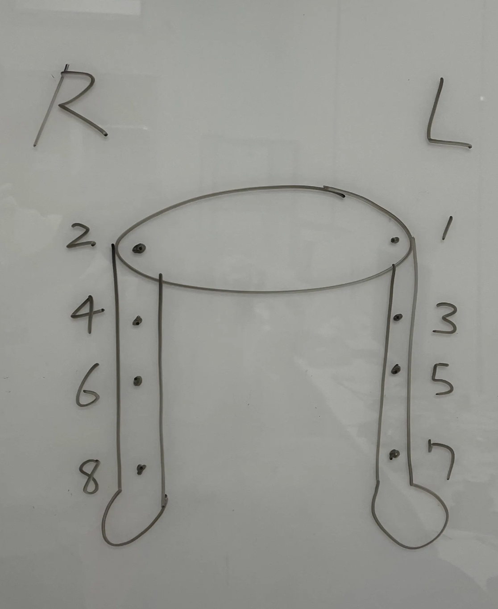

# hongdae_kist_bipedal

A collaborative bipedal robot motion control project developed by Hongik University and KIST AI Research Division.

## 🎥 Demo

<p align="center">
  
</p>

---

# Requirements
- Ubuntu 22.04 (other versions may work)
- ROS2 Humble
- MoveIt2 (Humble version)
- Python 3.10+
- Robstride RS-series motors
- CAN interface (slcand / SocketCAN)

---

# Paths
Make sure to place **bipedal_workspace** under `/home/` or you may need to adjust path configurations for:

- **play_and_record_csv_trajectory**
- **record_on_execute**

---

# Workflow

## 1. Launch MoveIt
```bash
$ ros2 launch kist_robot_config demo.launch.py
```

## 2. Execution
Executed joint states will be appended to:

```
/home/bipedal/joint_log.csv
```

If execution does not start, verify controller states:

```bash
$ ros2 control list_controllers
```

Activate `total_controller` if needed:

```bash
$ ros2 control switch_controllers \
  --deactivate right_leg_controller left_leg_controller \
  --activate total_controller \
  --strict --activate-asap
```

## 3. Trajectory Creation
After collecting motions (each 2 seconds), run the trajectory sampler:

```bash
$ ros2 run python_tools play_and_record_csv_trajectory \
  --ros-args \
  -p package_name:=bipedal_config \
  -p controller_name:=total_controller
```

This generates `joint_sample.csv` at 0.1s intervals.

## 4. Convert CSV to Python Lists
Run `csv_to_list.py` to generate list-based trajectories.

## 5. Run Motions on the Real Robot
Execute `player.py` to send motions to hardware.

---

# Port Settings (CAN)
```bash
$ sudo slcand -o -c -s8 [PORT_FOR_RIGHT_SIDE] can0
$ sudo slcand -o -c -s8 [PORT_FOR_LEFT_SIDE]  can1
$ sudo ip link set can0 up
$ sudo ip link set can1 up
```

---

# Motor ID Mapping

<p align="center">
  
</p>

---

# Contact
If you have any questions, feel free to contact me:

📧 **hwai566877@naver.com**
